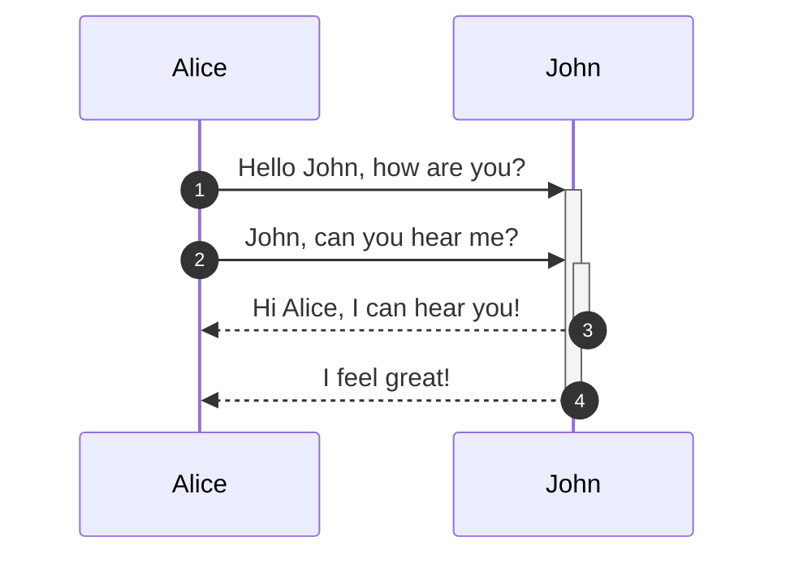
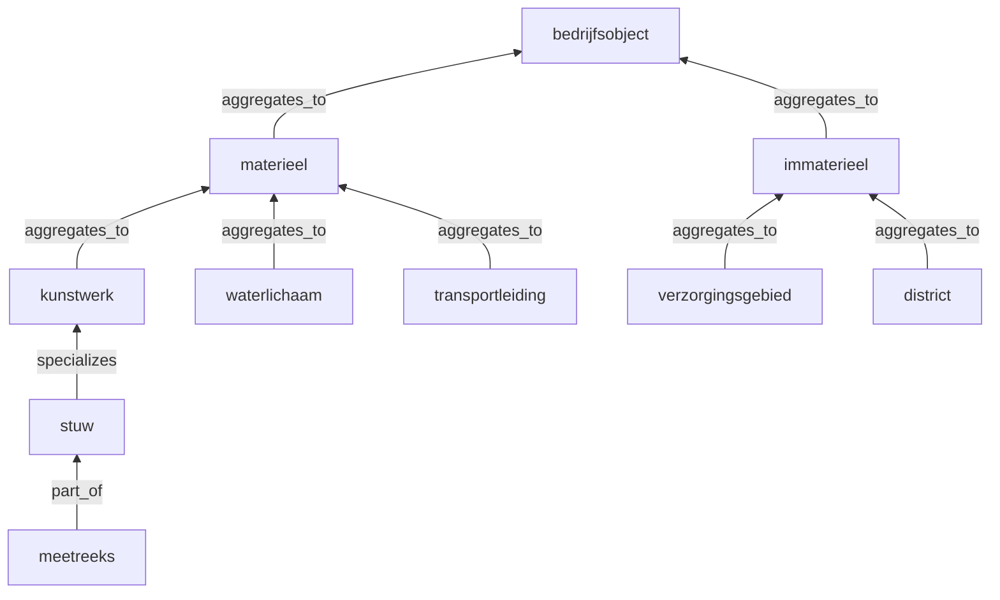
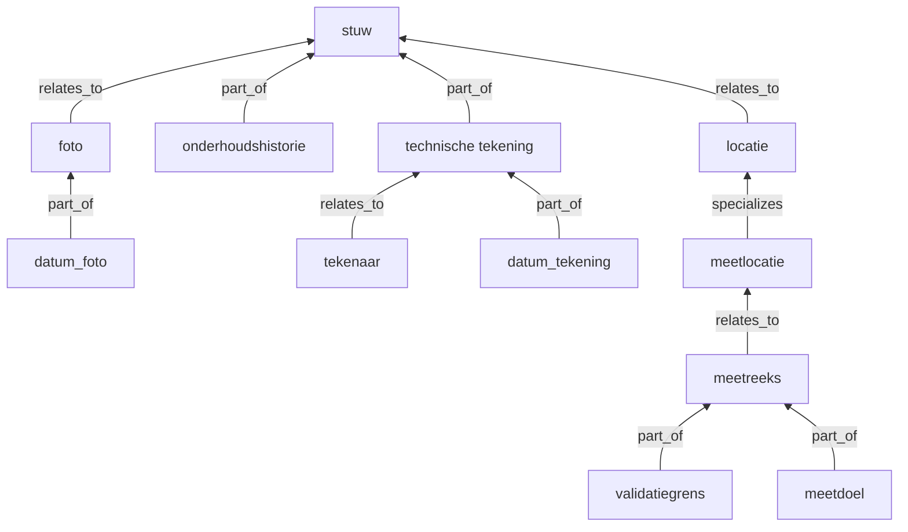
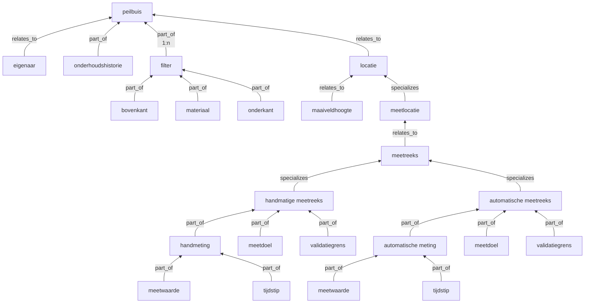
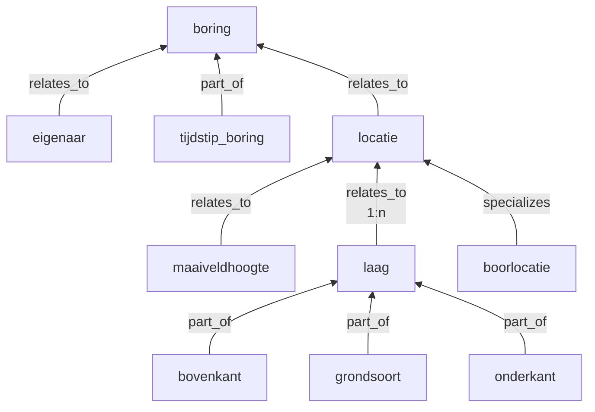

# GitBook\_test\_mermaid

Mermaid voorbeelden

In de tabel `md_synonym` zijn vertalingen van de relatienamen beschikbaar die o.a. voor im/exports (Excel) gebuikt kunnen worden. De namen zijn dan:

* relatie
* specialisatie
* afhankelijk
* erft
* instantie
* onderdeel
* aggregatie

Door andere (nieuwe) relaties te definieren kunnen andere modellen vastgelegd worden.
