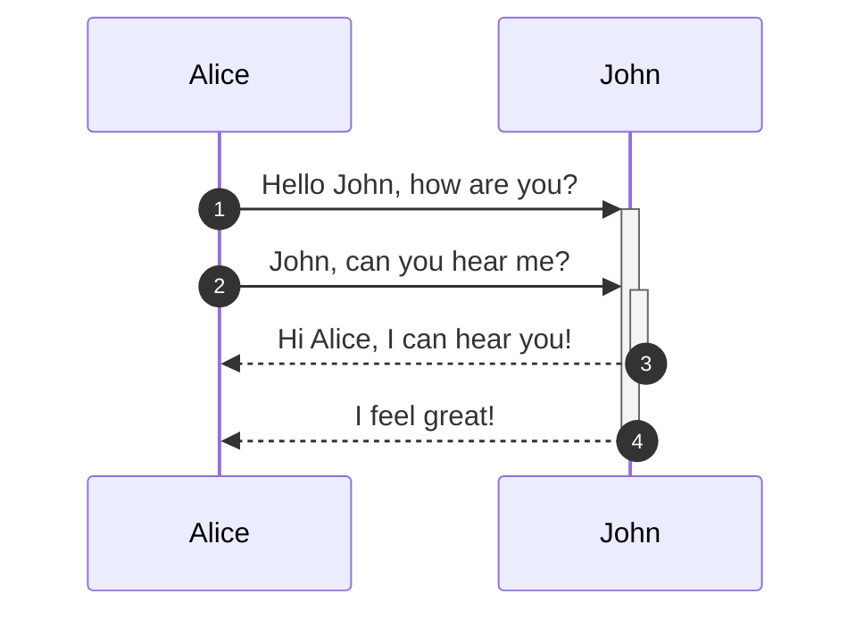
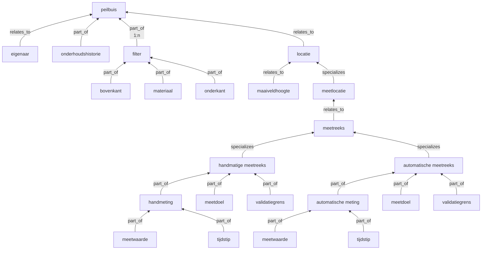

# Mermaid testjes

Mermaid voorbeelden (nu ANSI)

```mermaid
graph TD;
  A-->B;
  A-->C;
  B-->D;
  C-->D;
```

```mermaid
sequenceDiagram
    autonumber
    Alice->>+John: Hello John, how are you?
    Alice->>+John: John, can you hear me?
    John-->>-Alice: Hi Alice, I can hear you!
    John-->>-Alice: I feel great!
```

```mermaid
    flowchart BT
       eigenaar -- relates_to --> peilbuis
       onderhoudshistorie -- part_of --> peilbuis
       F[filter] -- part_of \n1:n --> peilbuis
       bovenkant -- part_of --> F[filter]
       materiaal -- part_of --> F[filter];
       onderkant -- part_of --> F[filter]
       locatie -- relates_to --> peilbuis
       maaiveldhoogte -- relates_to --> locatie
       ML[meetlocatie] -- specializes --> locatie

       MR[meetreeks] -- relates_to --> ML

       HMR[handmatige meetreeks] -- specializes --> MR
       AMR[automatische meetreeks] -- specializes --> MR

       HM[handmeting] -- part_of --> HMR
       HMD[meetdoel] -- part_of --> HMR
       HVG[validatiegrens] -- part_of --> HMR
       HMW[meetwaarde] -- part_of --> HM
       HT[tijdstip] -- part_of --> HM

       AM[automatische meting] -- part_of --> AMR
       AMD[meetdoel] -- part_of --> AMR
       AVG[validatiegrens] -- part_of --> AMR
       AMW[meetwaarde] -- part_of --> AM
       AT[tijdstip] -- part_of --> AM
```
