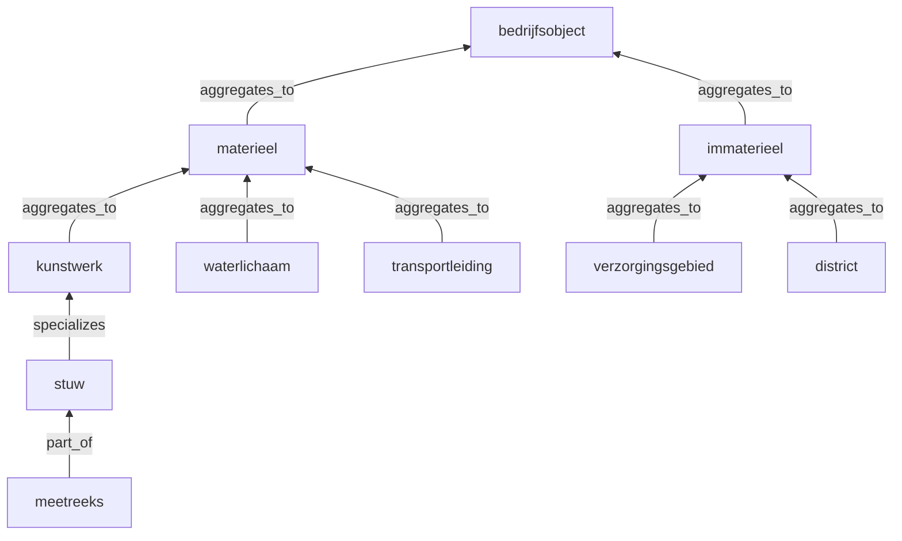
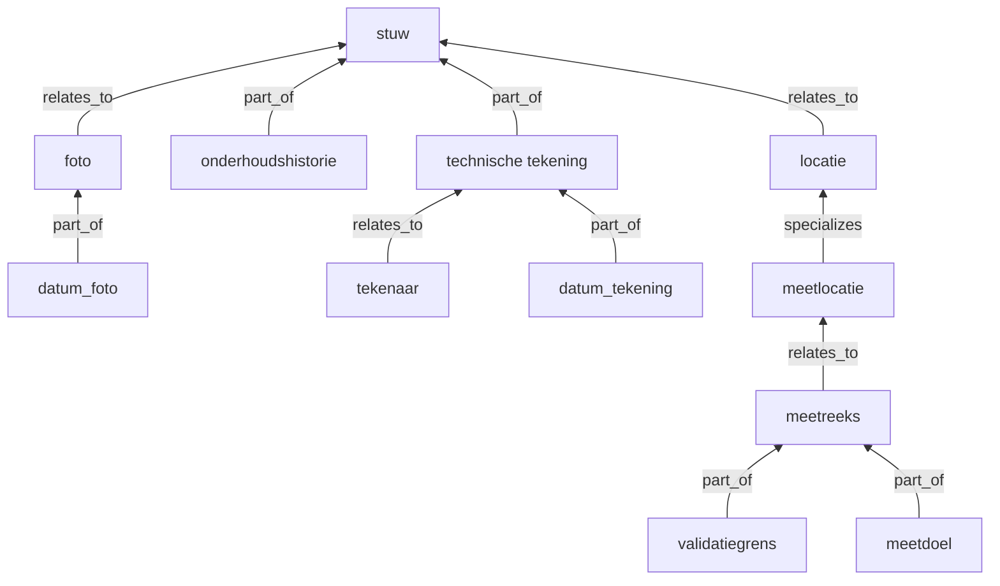
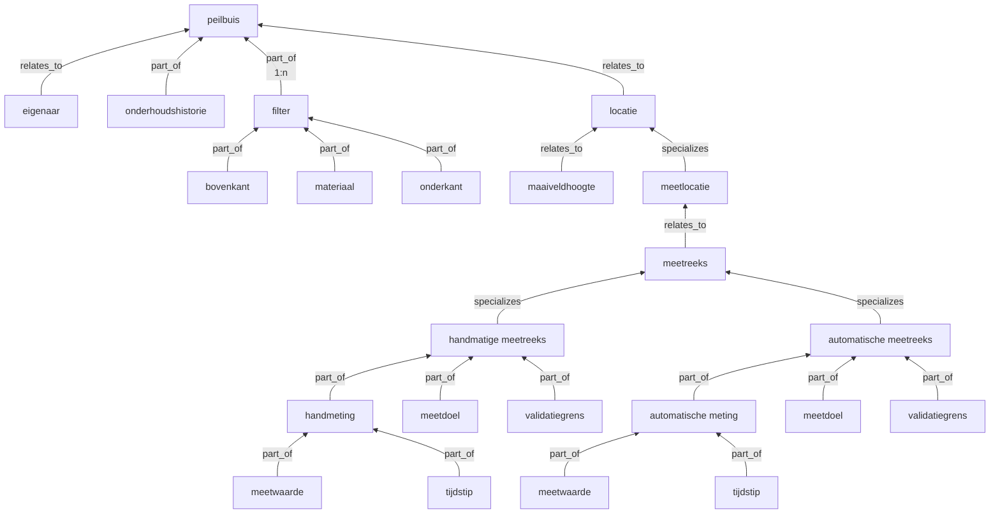
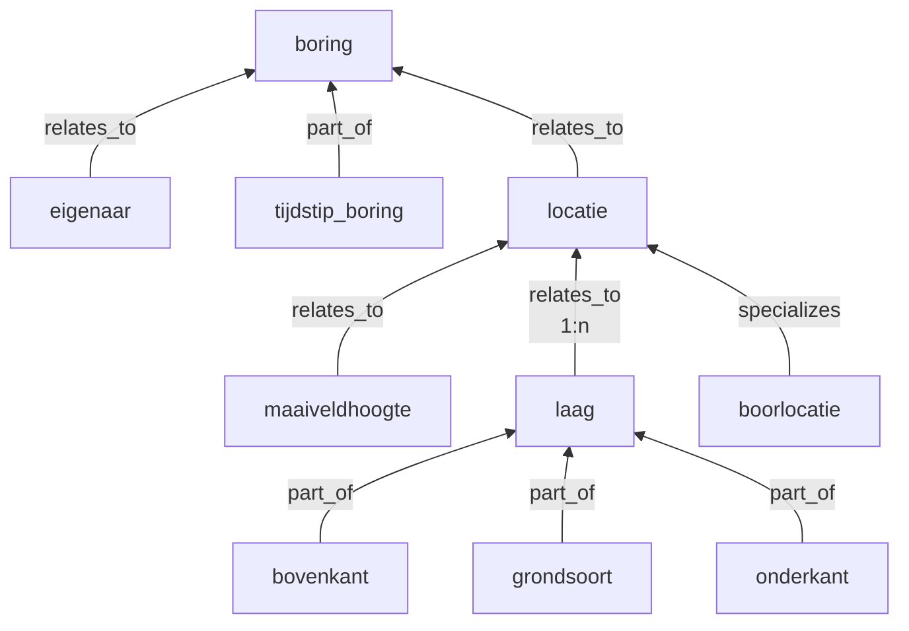

# Modelleren dataobjecten

.. admonition:: Wat is het...

    Dataobjecten kunnen via objectrelaties met andere dataobjecten gekoppeld worden en zo datamodellen beschrijven.

### Objectmodellen

* Vele dataobjecten in DataCatalog maken deel uit van *0..n* objectenmodellen.
* De datamodellen volgen zo mogelijk nationale standaarden zoals *Aquo*, *GWSW* etc.
* Een dataobject is *loosely coupled* aan attributen.

### Relaties

Het dataobjectenmodel kan hiërarchisch zijn, of een netwerk, of een matrix, een combinatie van dat alles en meer.
De relatietypes moeten bekend zijn in ``md_codelist`` onder de domeinnaam ``relation``.
Vooralsnog zijn Archimate-relaties en een geo-relatie ``share_location`` in DataCatalog opgenomen.

Bij het leggen van nieuwe relaties via ``id`` worden geautomatiseerd de unieke ``guid`` identificaties van de
attributen opgehaald.

In het basis (Archimate) objectenmodel worden alleen de volgende statische relaties gebruikt:

Relaties tussen dataobjecten

| n | Relatietype | Definitie |
| --- | ----------- | --------- |
| 1 | aggregates_to | Wordt geaggregeerd door bovenliggend dataobject |
| 2 | instanciates  | Concretiseert bovenliggend dataobject |
| 3 | inherits_from | Erft kenmerken van bovenliggend dataobject |
| 4 | specializes   | Verbijzondering van bovenliggend dataobject |
| 5 | part_of       | Is onlosmakelijk onderdeel van bovenliggend dataobject |
| 6 | depends_on    | Is afhankelijk van bovenliggend dataobject |
| 7 | relates_to    | Is gerelateerd aan bovenliggend dataobject |

Let op: We spreken hier over *dataobjecten*. Een dataobject 'stuw' is per definitie niet gelijk aan
een bedrijfsobject 'stuw'.

Een basis objectenmodel bevat de relaties 1, 2, 4, 5, 7. Dit is voldoende om DataCatalog te laten functioneren.

* ad1. Bijvoorbeeld dataobject 'stuw' -> dataobject 'kunstwerk' (compositie).
* ad2. Digital-twin dataobject van het bovenliggend (abstract) object.
* ad4. Bijvoorbeeld dataobject 'meetlocatie' -> dataobject 'locatie' (decompositie).
* ad5. Bijvoorbeeld 'stuwopening' -> 'stuw'
* ad6. Bijvoorbeeld 'locatie' -> 'stuw'
* ad7. Domeinafhankelijke relatie

Een abstract dataobject heeft zelf geen relaties met attributen, maar staat voor een verzameling dataobjecten.

### Uitvoering

* Alle dataobject relaties uit *verleden/heden/toekomst* staan in de DataCatalog tabel ``dc_obj_relation``.
* De *actuele* dataobject relaties staan beschreven in de DataCatalog view ``vw_object_relation``.
* Dataobjecten zijn via interne database id's gekoppeld aan attributen.

Als er relaties naar buiten gecommuniceerd worden, dan gebeurt dat altijd op basis van een ``guid`` identificatie.

De actuele (baseline) relaties staan in de DataCatalog tabel ``dc_obj_relation``.

### Voorbeelden

In de tabel ``md_synonym`` zijn vertalingen van de relatienamen beschikbaar die o.a. voor
im/exports (Excel) gebuikt kunnen worden. De namen zijn dan:

* relatie
* specialisatie
* afhankelijk
* erft
* instantie
* onderdeel
* aggregatie

Door andere (nieuwe) relaties te definieren kunnen andere modellen vastgelegd worden.
